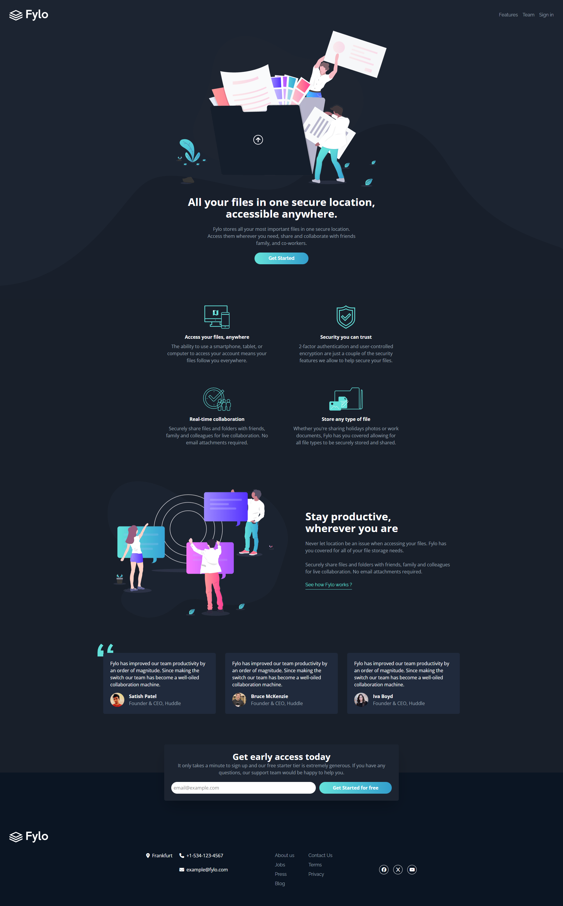
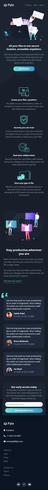

# Fylo Dark Theme Landing Page

## A responsive landing page with hero, features, testimonials, and email signup

This project implements a dark-themed landing page for Fylo, including a header, hero section, features list, testimonial quotes, footer, and an email signup form. The layout combines Flexbox and CSS Grid to achieve a visually balanced, responsive design that adapts seamlessly across different screen sizes.

The email form provides a clear call-to-action for early sign-ups, and the design emphasizes readability, clean spacing, and intuitive navigation. The project demonstrates effective use of modern CSS techniques to create structured and maintainable layouts while following best practices in responsive design.

### Screenshots

#### Image of the Desktop Design

#### Image of the Mobile Design

### Built with

- [React](https://react.dev/) - JS library
- [TypeScript](https://www.typescriptlang.org/) - type superset of JS
- [Tailwindcss](https://tailwindcss.com/) - utility-first CSS framework

## Author

- Website - [Mihailo Djurovic](portfolio-miahilo.vercel.app)